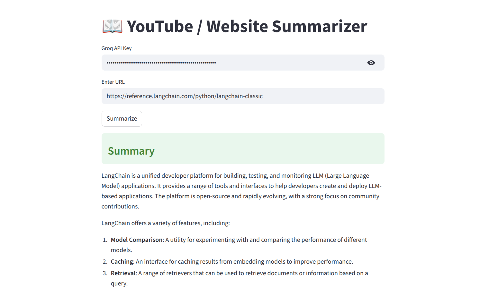

📖 YouTube & Website Content Summarizer

Summarizer is a simple Streamlit application that allows you to summarize content from YouTube videos and websites using AI.

Just paste a URL, and the app will extract the content and generate a concise summary.

✨ Features
- 🎥 Summarize YouTube videos
- 🌐 Summarize web articles & blogs
- ⚡ Fast AI-powered summaries using Groq (Llama 3)
- 🧠 Handles long content using smart chunking
- 💻 Clean and interactive Streamlit UI

🚀 How It Works
- Enter your Groq API Key
- Paste a YouTube or Website URL
- Click Summarize
- Get a clear summary instantly

🛠 Tech Stack
- Python
- Streamlit
- LangChain
- Groq (Llama 3 model)
- BeautifulSoup (for web scraping)
- YouTube Transcript API
